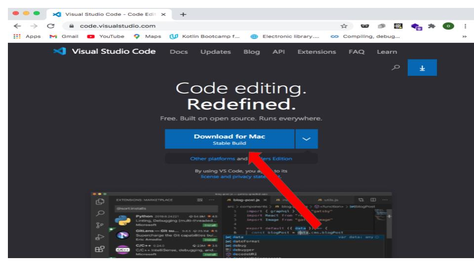
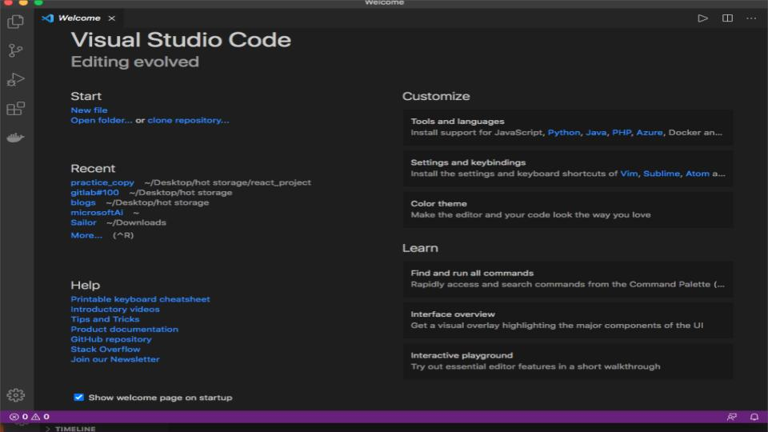
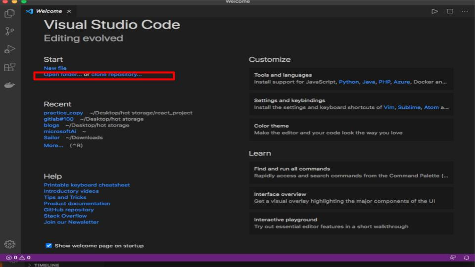
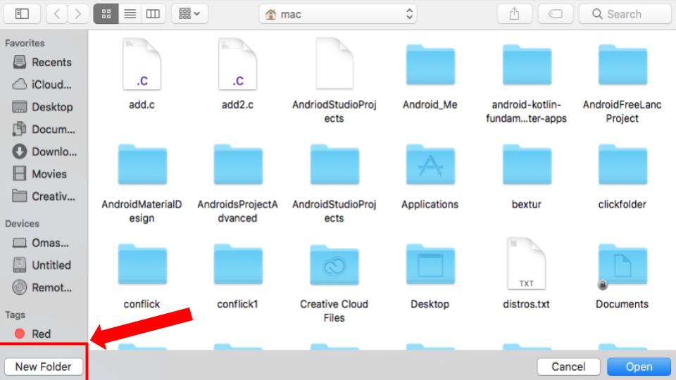
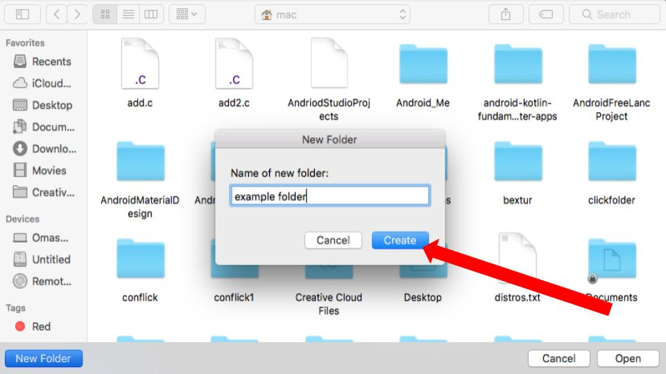
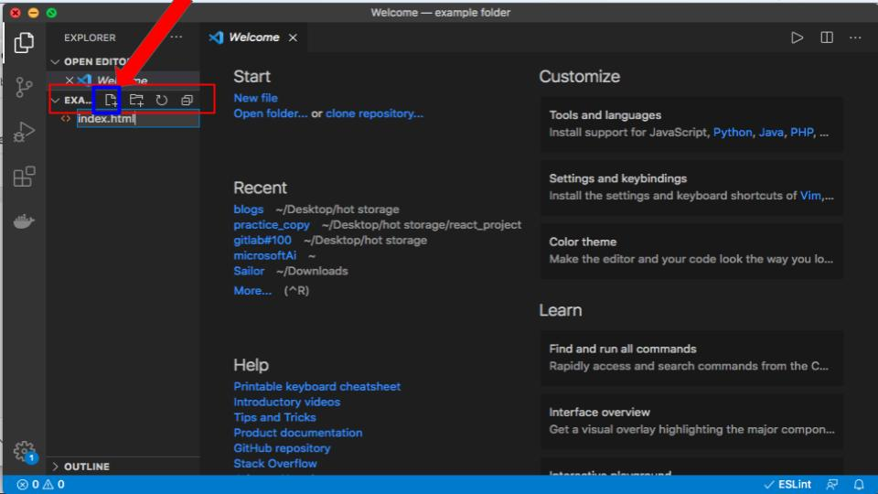
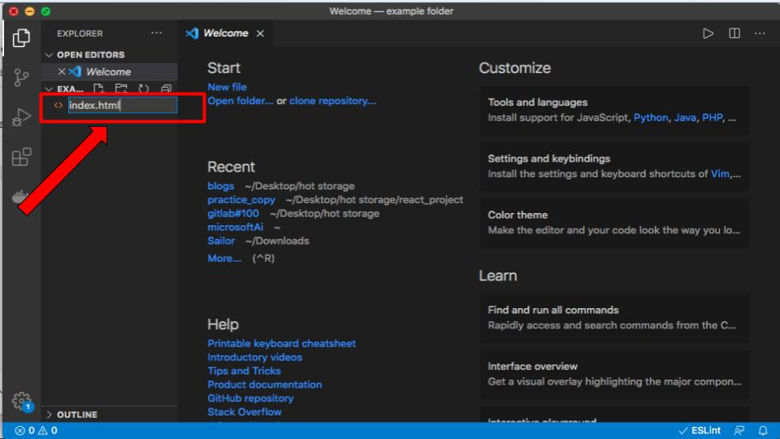
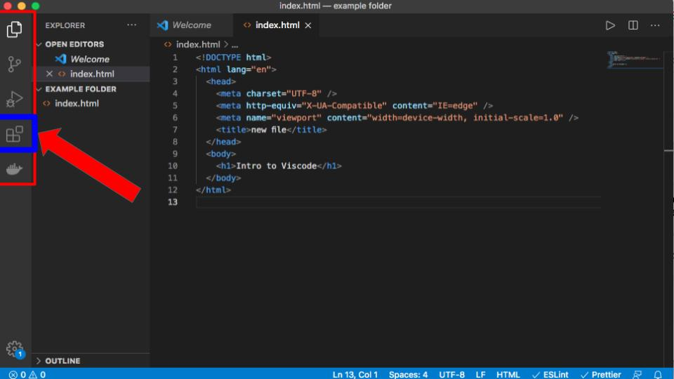
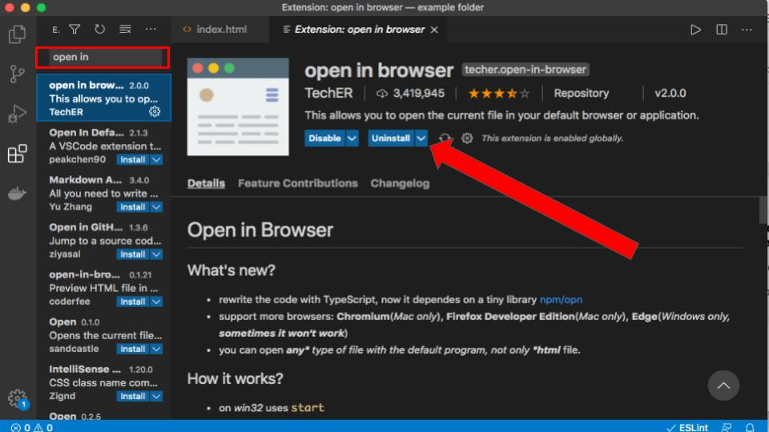
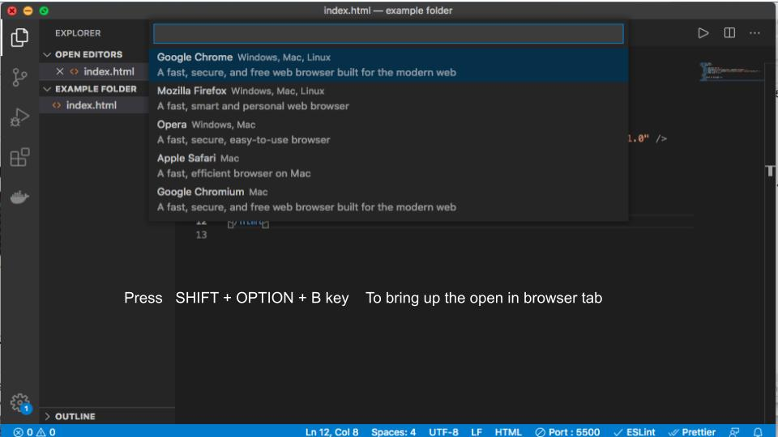

So you are interested in writing codes! Nice one. You need a code editor.

Let me introduce you to the one I thought of as being both beginner friendly and highly customisable - [VISUAL STUDIO CODE](https://code.visualstudio.com/)

My opinion on this doesn't have to be final, here are other person's opinions on it:

> VS Code is my most used and favorite editor. I love being able to customize the editor - changing the layout, the icons, fonts and color scheme is so easy! - Pavithra Kodmad.

> VS @code does so many things right. I’m constantly impressed by the UX, and customizing workspace / user preferences is no exception. 🙌🏼💯 It just keeps getting better ❤️ - Una Kravets

This article is not centre on the awesomeness of vscode, though that would have been very cool, the article however, is focused on how you can get start with vscode. so shall we begin.

#### On Windows

##### Step One

Download visual studio code for windows from the [visual studio code website]() here to your system. Then open the folder to install the editor.

#### On Mac

In mac, the installation is much more simpler than in windows.

##### Step One

Head to [visual studio code](https://code.visualstudio.com/) to download vscode for mac.

##### Step two

Go to your downloads (on your computer) and unzip the viscode file you just download by double clicking on it.
After unzipping, double click on the file to install and wait for it to finish installing. And that my friend is how you do it.

**Alternatively**

### Setting up your very first work station on vscode.

Let's proceed to the post installation phase of the article.
After installing it opens you to the welcome page like so.

On the welcome page you will see the start heading among the others. Underneath it you have the new file and the open folder or clone repository subheadings. Our starting point will be the open folder subheading.

**Creating a Folder**

Next we create a folder. start by clicking on the open to create a new folder.

On clicking on the open folder, it opens up your computer folder directory. To create a new folder click on the new.

Click on the open button to open the new folder you just created to your visual studio code.

**Creating a new file and opening it a browser**

Back to the visual studio. If you observe very closely, you will at the bottom of the editor that color has changed from purple to blue indicating that you now have a folder opened.

Time to create your first file. For the course of this article, we will be creating a html file.
So to create a file hover your mouse over the name of the folder you created to bring up the create new file icon.

Click on the icon to create a new html. You decide to name it anything, say index.html.

**Configuring vscode to open your html file on the browser**

Say you have successfully created a html file and you now want to view it on the browser to see how it looks. Vscode does not come with a default functionality to do that, but that is not a problem at all. Like I have mentioned above, vscode is highly customizable owning its rich store of extensions which one can use to extend its functionality. We will now add the function of opening our html files in the browser by installing the ‘open in browser’ plugin from the vscode extension store. Follow the picture representation to do that:

On clicking on the extensions icon it opens up this next page where you can search for any extension/plugin available on vscode to install. In our case, we will type “open in browser” on the search bar which brings up a list of plugins. W will go for the very first one on the list. Click on it and it opens up information about the plugins along with documentation and installation button.

After installation, go back to the file explorer, and use this command SHIFT+ALT+B to bring up the 'open in browser' tab. choose any of the browser to view your file.

That my friend, is how you can get started with vscode. Visual studio code is very versatile code editor, there much more to it. I will strongly recommend that you go through the [documentation here](https://code.visualstudio.com/docs) to find out more for yourself.
